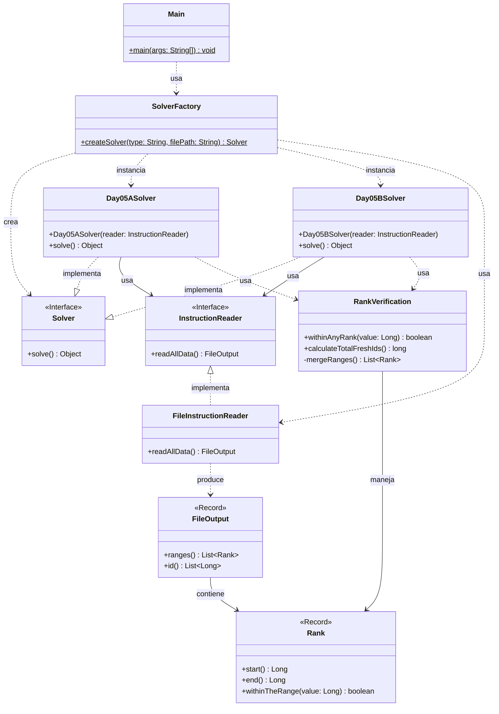

# Advent of Code 2025 - Día 5: Verificación de Rangos de IDs

Este proyecto contiene la solución para el **Día 5** del Advent of Code 2025. El desafío consiste en procesar conjuntos de rangos numéricos ("Ranks") y listas de identificadores, realizando validaciones de pertenencia y cálculos de cobertura total mediante la fusión de intervalos.

## Diseño y Arquitectura

En este proyecto se aplican estrictamente los principios SOLID y Clean Code, junto con patrones de diseño estratégicos para garantizar un código mantenible, extensible y testeable.

### 1. Principios SOLID

- **Single Responsibility Principle (SRP)**:
  - `SolverFactory`: Responsable únicamente de la creación de los objetos Solver según el tipo ("A" o "B").
  - `FileInstructionReader`: Responsable de la lectura y parseo del archivo de entrada hacia un objeto de transferencia `FileOutput`.
  - `Day05ASolver` / `Day05BSolver`: Contienen la lógica específica de coordinación para cada parte del problema.
  - `RankVerification`: Encapsula toda la lógica de dominio relacionada con los rangos (validación de pertenencia, fusión de intervalos, cálculo de cobertura).
  - `Rank`: Record inmutable que modela un intervalo con inicio y fin.
- **Open/Closed Principle (OCP)**:
  - El sistema permite agregar nuevas estrategias de resolución (ej. Parte C) implementando la interfaz `Solver` y registrándola en la fábrica, sin modificar el código existente.
  - `InstructionReader` permite integrar nuevas fuentes de datos (API, Base de Datos) sin alterar la lógica de los solvers.
- **Liskov Substitution Principle (LSP)**:
  - `Day05ASolver` y `Day05BSolver` implementan la interfaz `Solver`, siendo completamente intercambiables para el cliente (`Main`).
- **Interface Segregation Principle (ISP)**:
  - `InstructionReader` define un contrato específico y conciso para la lectura de datos (`readAllData`), evitando obligar a las clases a depender de métodos que no utilizan.
- **Dependency Inversion Principle (DIP)**:
  - Los módulos de alto nivel (`Main`, Solvers) dependen de abstracciones (`Solver`, `InstructionReader`), y no de implementaciones concretas como `FileInstructionReader`.

### 2. Patrones de Diseño

Se han implementado patrones de diseño para estructurar la creación y el comportamiento:

- **Strategy Pattern (Estrategia)**:

  - La interfaz `Solver` define la estrategia genérica. `Day05ASolver` (conteo de IDs válidos) y `Day05BSolver` (cálculo de cobertura total de rangos) son las estrategias concretas.

- **Factory Pattern (Fábrica)**:

  - `SolverFactory`: Centraliza la lógica de decisión e instanciación de los Solvers.
  - `ReaderFactory`: Abstrae la creación del `InstructionReader`, permitiendo cambiar la implementación de lectura fácilmente.

- **Dependency Injection**:
  - El `InstructionReader` se inyecta en el constructor de los Solvers (`Day05ASolver`, `Day05BSolver`). Esto desacopla la obtención de datos de su procesamiento.

### 3. Clean Code y Refactorización

Aspectos clave para la legibilidad y mantenimiento:

- **Records**: Uso de Java Records (`Rank`, `RankVerification` - aunque este tiene lógica, `FileOutput`) para modelar datos inmutables de forma concisa.
- **Meaningful Names**: Nombres expresivos para métodos y variables (`withinAnyRank`, `calculateTotalFreshIds`, `mergeRanges`).
- **Encapsulation**: La lógica compleja de fusión de rangos se encapsula dentro de `RankVerification`, manteniendo los Solvers limpios y enfocados en la orquestación.

### 4. Diagrama de Arquitectura

### 5. Estructura del Proyecto

La estructura de paquetes organiza el código por responsabilidad y funcionalidad:

- `software.aoc.day05`: Interfaces (`Solver`, `InstructionReader`), fábricas (`SolverFactory`, `ReaderFactory`) y modelo de dominio (`Rank`, `RankVerification`, `FileOutput`).
- `software.aoc.day05.a`: Implementación concreta de la estrategia para la Parte A (`Day05ASolver`).
- `software.aoc.day05.b`: Implementación concreta de la estrategia para la Parte B (`Day05BSolver`).
