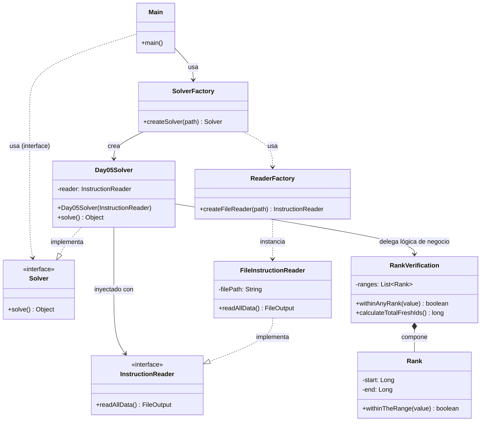

# Advent of Code 2025 - Día 5: Inventory Management System

Este repositorio contiene la solución para el Día 5 del Advent of Code 2025, implementada en Java. El problema se centra en gestionar un sistema de inventario de ingredientes, determinando cuáles son frescos basándose en rangos de IDs.

## Descripción del Problema

### Parte 1

El objetivo es determinar cuántos de los IDs de ingredientes disponibles son "frescos". Un ID se considera fresco si cae dentro de cualquiera de los rangos de IDs frescos proporcionados en la base de datos.

### Parte 2

El objetivo cambia a calcular el número total de IDs únicos que son considerados frescos por la unión de todos los rangos de IDs frescos, ignorando la lista de IDs disponibles.

## Estructura del Proyecto

El código está organizado en dos paquetes principales dentro de `src/main/java/software/aoc/day05`, correspondiendo a cada parte del problema:

- **`a`**: Contiene la solución para la Parte 1.
- **`b`**: Contiene la solución para la Parte 2.

Esta separación permite mantener independientes las lógicas de cada parte, aunque compartan conceptos similares.

## Principios de Diseño y Arquitectura

Para asegurar un código robusto, flexible y mantenible, la solución ha evolucionado aplicando principios SOLID avanzados y patrones de diseño.

### 1. Principio de Responsabilidad Única (SRP)

Cada clase tiene una responsabilidad claramente definida:

- **`InstructionReader` (Interface) / `FileInstructionReader`**: Responsables exclusivamente de la lectura y parseo de datos.
- **`RankVerification`**: Encapsula la lógica de dominio (reglas de negocio sobre rangos).
- **`Day05ASolver` / `Day05BSolver`**: Orquestan la solución de cada parte, coordinando la lectura y la verificación.
- **`ReaderFactory`**: Centraliza la creación de objetos de lectura.

### 2. Principio de Inversión de Dependencias (DIP) y Uso de Interfaces

Se ha desacoplado la lógica de alto nivel de los detalles de bajo nivel mediante interfaces:

- **Abstracción sobre Implementación**: Los solucionadores (`Solver`) no dependen de la clase concreta `FileInstructionReader`, sino de la interfaz `InstructionReader`.
- **Beneficio**: Esto permite cambiar la fuente de datos (por ejemplo, leer de una API o un String para tests) sin modificar una sola línea de la lógica de resolución.

### 3. Patrón Factory Method

Se utiliza extensivamente el patrón Factory para la creación de objetos, centralizando la configuración y el ensamblaje de dependencias:

- **`ReaderFactory`**: Encapsula la creación del `InstructionReader`.
- **`SolverFactory`**: Encapsula la creación del `Solver` completo. No solo instancia la clase, sino que también resuelve sus dependencias (como obtener el `InstructionReader` necesario).
- **Flexibilidad**: El `Main` queda completamente limpio de lógica de construcción. Solo pide un "solucionador" y lo ejecuta.

### 4. Inyección de Dependencias

Las dependencias clave se inyectan a través del constructor. La `SolverFactory` es quien actúa conceptualmente como el "inyector", pasando la instancia correcta de `InstructionReader` al constructor de `Solver`.

### 5. Modularidad e Independencia

Se mantiene la separación estricta entre paquetes `a` (Parte 1) y `b` (Parte 2). Aunque comparten conceptos, cada paquete posee su propio "set" de interfaces e implementaciones. Esto evita el acoplamiento accidental entre las dos partes del problema, permitiendo que evolucionen de manera totalmente independiente.

## Diagrama de Clases

A continuación se muestra el diagrama de clases actualizado. Nótese cómo `Main` ahora solo depende de `SolverFactory` y la interfaz `Solver`, logrando un desacoplamiento máximo.

